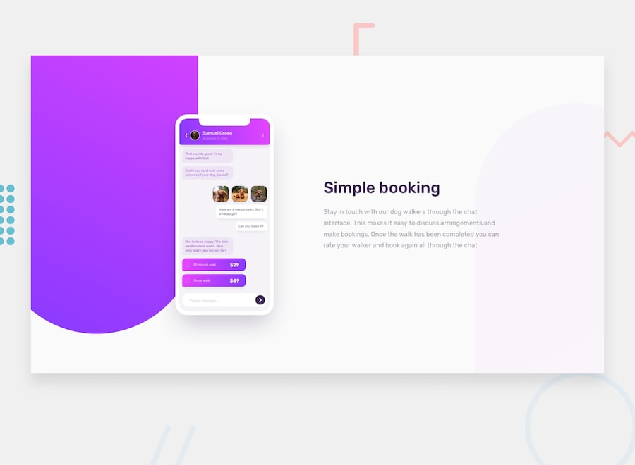

# Chat app CSS illustration

Esta é uma solução para o [Chat app CSS illustration on Frontend Mentor](https://www.frontendmentor.io/challenges/chat-app-css-illustration-O5auMkFqY/hub). Os desafios do Frontend Mentor ajudam você a melhorar suas habilidades de codificação criando projetos realistas.

## Índice

- [Visão geral](#visão-geral)
  - [O desafio](#o-desafio)
  - [captura de tela](#captura-de-tela)
  - [Links](#links)
  - [Construído com](#construído-com)
- [Autor](#autor)

## Visão geral

### O desafio

Seu desafio é criar essa ilustração de recursos usando HTML e CSS e deixá-la o mais próximo possível do design.

Os únicos recursos que fornecemos neste desafio são a imagem da pessoa na interface do usuário do aplicativo e as 3 imagens do cachorro. Você precisa criar todo o resto usando HTML e CSS!

Seus usuários devem ser capazes de:

- Veja o layout ideal para o componente, dependendo do tamanho da tela do dispositivo

# captura de tela

### Links

- URL da solução: [Link da solução](https://www.frontendmentor.io/challenges/chat-app-css-illustration-O5auMkFqY/hub)
- URL do site ao vivo: [demonstração](https://matheusmanuel.github.io/Chat-app-CSS-illustration/)

### Construído com

- HTML
- Propriedades personalizadas CSS 3
- Flexbox
- javascript

## Autor

- Website - [Matheus manuel](https://matheusmanuel.github.io/)
- Frontend Mentor - [@matheusmanuel](https://www.frontendmentor.io/profile/matheusmanuel)
- instagram - [@matheusmanuel.dev/](https://www.instagram.com/matheusmanuel.dev/)
- youtube - [@mathesmanuel](https://youtube.com/matheusmanuel)